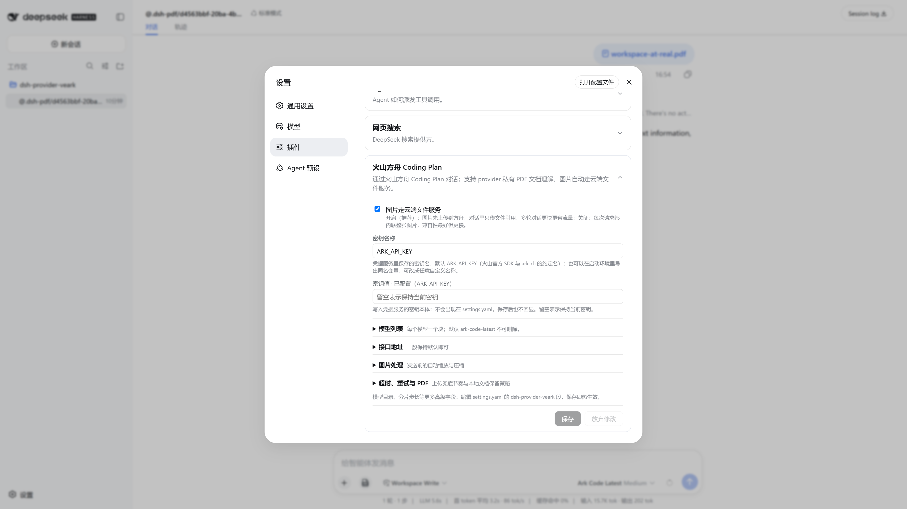
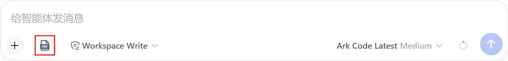
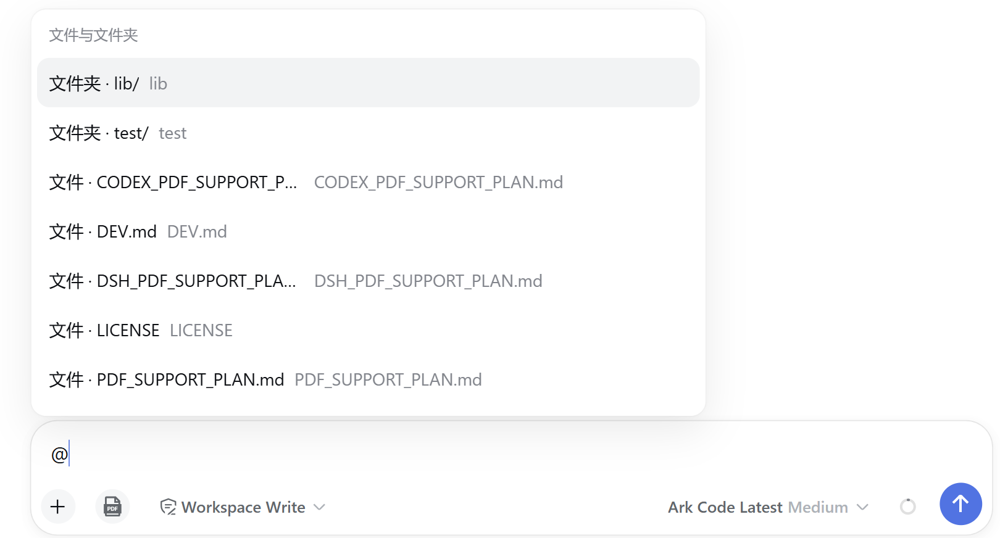

# dsh-provider-veark · Volcengine Ark Coding Plan Provider for DeepSeek Harness

<p align="center">
  <a href="README.md">中文</a> | English
</p>

<p align="center">
  <a href="https://github.com/IcedWatermelonJuice/dsh-provider-veark/releases"></a>
  &nbsp;
  <a href="https://www.npmjs.com/package/@deepseek-ai/dsh"></a>
  &nbsp;
  <a href="https://www.npmjs.com/package/@volcengine/ark-runtime"></a>
  &nbsp;
  
  &nbsp;
  
</p>

<p align="center">
  <strong>Plug Volcengine Ark Coding Plan into DeepSeek Harness: text, images, and PDF document understanding</strong><br>
</p>

<div align="center">

[Install](#install) · [Configuration](#configuration) · [Uninstall](#uninstall) · [Endpoints & Billing](#endpoints--billing) · [Known Limitations](#known-limitations) · [Development](#development)

</div>

---
## Install

The commands below use the `web` profile as an example (replace it with your own profile name, e.g. `headless`). Pick any one of the three ways, then **restart DSH**.

> **First install fails with `ERR_PNPM_IGNORED_BUILDS`?** pnpm 11+ blocks dependency build scripts by default (involving `protobufjs`). Allow the build once, then re-run the install command:
>
> ```bash
> dsh plugin --profile web approve-builds protobufjs
> ```
>
> After approving, re-run the install command below. You only need to do this once.

### Option 1: npm registry (recommended)

```bash
dsh plugin --profile web add @icedcola/dsh-provider-veark
```

### Option 2: GitHub source

```bash
dsh plugin --profile web add github:IcedWatermelonJuice/dsh-provider-veark
```

### Option 3: local link (development)

```bash
dsh plugin --profile web add /path_to_dsh-provider-veark
```

> A local install is a **link-style install**: it references the source directory directly, so code changes take effect immediately; do **not** delete or move that directory while installed, or bundle resolution breaks.

## Configuration

1. Open the DSH web UI → **Settings → Plugins → "火山方舟 Coding Plan"**, expand the card.
2. Paste your **API key** (Volcengine Ark API key) → **Save**. The key is stored in the DSH credentials service; it is never echoed back or written to settings.yaml.
3. Done. "火山方舟 Coding Plan" now appears in model selection (default `ark-code-latest`); text, image, and PDF document understanding are ready.



To use a PDF, select a model that declares the `pdf` input capability (the default `ark-code-latest` does). Reference a workspace document directly as `@docs/file.pdf`, or use `@"docs/my paper.pdf"` for spaces. For a document outside the workspace, click **PDF** beside the Composer; the plugin stages an immutable snapshot immediately and appends `@.dsh-pdf/<uuid>/<filename>` to the draft. `/pdf` remains only as a migration hint. The button is visible only for this plugin's `volcengine` provider when the selected model declares `pdf`. Custom models default to `text`; enable `pdf` only when their actual endpoint supports document understanding.





The card also offers collapsible sections for cloud image handling, endpoints, image limits, local PDF retention, retries, and the model list. Leave any field empty to restore its default.

<details>
<summary>Advanced settings.yaml fields (optional)</summary>

These can also be set by editing the `dsh-provider-veark:` section of `%DSH_HOME%\settings.yaml` (hot-reloads on save; the whole section may be omitted = all defaults):

```yaml
dsh-provider-veark:
  preferFiles: true
  chatBaseURL: https://ark.cn-beijing.volces.com/api/coding/v3   # coding gateway, do not change
  filesBaseURL: https://ark.cn-beijing.volces.com/api/v3         # switch to …/api/coding/v3 when standard domain returns 403
  apiKeyEnv: ARK_API_KEY
  # models:
  #   - id: ark-code-latest
  #     name: Ark Code Latest
  #     contextWindow: 1000000
  #     maxTokens: 128000
  #     inputModalities: ["text", "image", "pdf"]
  #     imagePixelBudget: 640000
  #     imageMaxBytes: 1048576
  # requestImagePixelBudget: 640000
  # requestImageMaxBytes: 1048576
  # fileExpirySeconds: 604800
  # filesApiTimeoutMs: 15000
  # filesProbeIntervalMs: 21600000
  # pdfRetentionDays: 0       # 0 = keep indefinitely; 1–3650 = clean old sidecars on a later upload
```

Alternatively, skip the card entirely and set the `ARK_API_KEY` environment variable before starting DSH (or a custom reference name via `apiKeyEnv`).

</details>

## Uninstall

```bash
dsh plugin --profile web remove @icedcola/dsh-provider-veark
```

Then restart DSH. The plugin does not modify Harness source files. You may also delete `%DSH_HOME%\dsh-provider-veark\` (image state) and `%DSH_HOME%\provider-veark\` (PDF sidecars). Removing sidecars makes historical PDF tokens unreadable.

## Endpoints & Billing

| Request | URL | Billing |
|---|---|---|
| Chat | `…/api/coding/v3/responses` | Coding Plan subscription |
| File upload/delete | `…/api/v3/files` (default) | Storage API, no model tokens |
| PDF understanding | Base64 `input_file` inside the chat request | Coding Plan; no Files API or TOS |

> Field-tested (2026-08, coding key): the coding gateway `/api/coding/v3/files` is not available; the standard domain `/api/v3/files` works. It looks like Volcengine may migrate file storage for coding plans over to the standard domain later. The default (standard domain) already works — no configuration needed.

## Known Limitations

- Each PDF and the cumulative raw PDF data in one request are capped at 45 MiB, leaving overhead below Ark's 50 MB per-file and 64 MB whole-request limits.
- PDF-button sidecars live under `%DSH_HOME%\provider-veark\pdfs\`. Used snapshots are kept indefinitely by default; unused staged pairs and incomplete orphans are removed after a 24-hour grace period. `pdfRetentionDays` enables optional cleanup of used snapshots, after which old sessions cannot reopen them.
- Plain `@path.pdf` references can read only relative paths contained by the current session workspace. Absolute and escaping paths remain ordinary text. Workspace references read the file's current contents on each request; PDF-button sidecars are immutable selection-time snapshots.
- Session JSONL export alone does not include sidecars; migrate that directory as well for cross-machine restoration.
- Assistant reasoning blocks are not replayed in history (Responses protocol limitation).
- Video, audio, and TOS direct upload are not supported.

## Development

Architecture, tests, publishing and the rollback manual live in [DEV.md](./DEV.md).

```bash
pnpm install
pnpm test
```

## License

[MIT](LICENSE)
